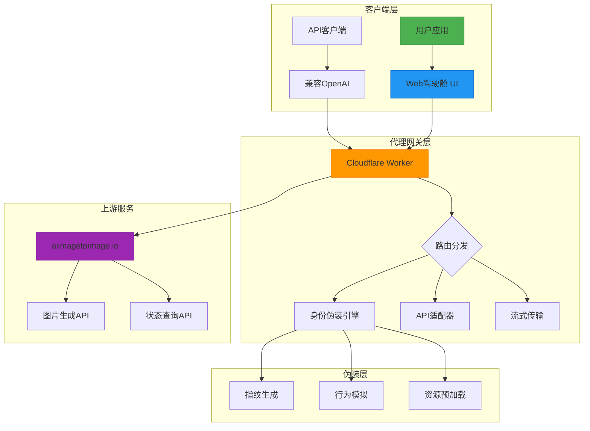
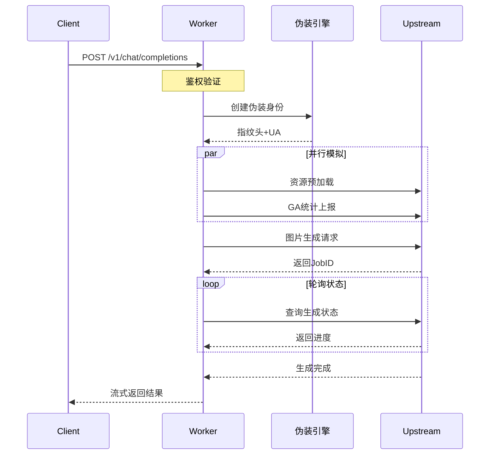

# 🖼️ aiimagetoimage-2api (Cloudflare Worker 终极版)

<p align="center">
  
  
  
  
</p>

<p align="center">
  <strong>代号：Chimera Reborn (奇美拉重生) • Absolute Stealth (绝对隐匿)</strong>
</p>

<p align="center">
  🚀 将顶级AI图生图能力转化为免费、开源、企业级的API解决方案
</p>

<p align="center">
  <a href="#快速部署">快速部署</a> • 
  <a href="#系统架构">系统架构</a> • 
  <a href="#功能特性">功能特性</a> • 
  <a href="#技术深度">技术深度</a> • 
  <a href="#使用方法">使用方法</a>
</p>

## 📖 项目简介

**aiimagetoimage-2api** 是一个将 [aiimagetoimage.io](https://aiimagetoimage.io) 强大的图生图能力完美转化为标准 OpenAI Vision API 格式的 Cloudflare Worker 解决方案。它不仅是一个简单的代理，更是一套完整的**身份伪装引擎**和**企业级API网关**，让开发者能以零成本集成顶级的AI绘图能力。

### ✨ 核心价值
- **🚀 零成本运行**：基于 Cloudflare Workers 免费额度，每月10万次API调用
- **🎭 深度隐身**：内置高级浏览器指纹伪装，模拟真实用户行为
- **🖥️ 专业驾驶舱**：现代化Web界面，实时监控、调试、管理一体化
- **🔌 即插即用**：完全兼容 OpenAI Vision API 标准，无缝接入现有系统

---

## 🚀 快速部署

### 一键部署按钮
<p align="center">
  <a href="https://deploy.workers.cloudflare.com/?url=https://github.com/lza6/aiimagetoimage-2api-cfwork">
    
  </a>
</p>

### 手动部署步骤

#### 第一步：创建 Cloudflare Worker
```bash
# 1. 登录 Cloudflare Dashboard
# 2. 进入 Workers & Pages
# 3. 点击 "Create application"
# 4. 选择 "Create Worker"
```

#### 第二步：配置环境变量
| 变量名 | 默认值 | 说明 |
|--------|--------|------|
| `API_MASTER_KEY` | `1` | API 访问密钥 |

#### 第三步：部署代码
```javascript
// 将项目中的 worker.js 代码完整复制到 Cloudflare Worker 编辑器
// 点击 "Save and Deploy"
```

#### 第四步：访问驾驶舱
```
https://你的worker.你的子域.workers.dev/
```

---

## 🏗️ 系统架构

### 整体架构图


### 请求处理流程图


---

## 🎯 功能特性

### 🖼️ 核心功能
| 功能 | 状态 | 说明 |
|------|------|------|
| 图片生成 | ✅ 完全支持 | 基于文本提示和参考图片生成新图像 |
| 多模型选择 | ✅ 完全支持 | Nano Banana（快速）和 Standard（标准）模型 |
| 比例调整 | ✅ 完全支持 | 8种预设比例，支持匹配原图 |
| 批量处理 | 🔄 计划中 | 批量图片生成和队列管理 |

### 🔌 API 兼容性
| 标准 | 兼容性 | 说明 |
|------|--------|------|
| OpenAI Vision API | ✅ 完全兼容 | 可直接替换 GPT-4V 接口 |
| SSE 流式传输 | ✅ 完全支持 | 实时进度反馈和结果返回 |
| RESTful 接口 | ✅ 完全支持 | 标准 HTTP/JSON 接口 |
| CORS 跨域 | ✅ 自动处理 | 支持浏览器直接调用 |

### 🛡️ 安全特性
| 特性 | 实现 | 优势 |
|------|------|------|
| API 密钥保护 | Bearer Token 验证 | 防止未授权访问 |
| 频率限制 | 上游429识别 | 智能限流处理 |
| 数据安全 | 内存级处理 | 图片数据不持久化 |
| 访问控制 | CORS 白名单 | 灵活的来源控制 |

---

## 🧠 技术深度解析

### 1. 身份伪装引擎（IdentityManager）
```javascript
// 动态生成浏览器指纹
const chromeVersion = `143.0.${Math.random()*9999}.${Math.random()*999}`;
const headers = {
    "sec-ch-ua": `"Google Chrome";v="143", "Chromium";v="143"`,
    "user-agent": `Mozilla/5.0 Chrome/${chromeVersion}`,
    // 完整模拟现代浏览器指纹
};
```

**技术特点：**
- 🔄 **动态 UA 生成**：每次请求使用不同的 Chrome 版本号
- 🎯 **Sec-CH-UA 字段**：模拟现代浏览器的客户端提示
- 🌍 **地理位置模拟**：预设中文语言和时区设置
- 🚫 **无痕模式**：不发送 X-Forwarded-For 等可能暴露代理的字段

### 2. 行为模拟算法
```javascript
// 模拟真实用户访问模式
async function simulateRealUserBehavior() {
    await preloadResources();      // 资源预加载
    await sendGoogleAnalytics();   // GA统计上报
    await randomDelay(1000-2000);  // 人类操作延迟
}
```

**模拟策略：**
- 📊 **Google Analytics**：发送真实的 GA 统计请求
- 🖼️ **资源预加载**：模拟浏览器预加载关键资源
- ⏱️ **随机延迟**：避免过于机械的请求模式
- 🔄 **会话保持**：维持合理的请求间隔

### 3. 流式传输引擎
```javascript
// 使用 TransformStream 实现 SSE
const { readable, writable } = new TransformStream();
const writer = writable.getWriter();

// 实时推送进度
ctx.waitUntil((async () => {
    while (!completed) {
        await writer.write(encoder.encode(`data: ${JSON.stringify(progress)}\n\n`));
        await delay(3000);
    }
})());
```

**技术优势：**
- 🌊 **真正的流式**：支持 Server-Sent Events (SSE)
- 📡 **实时反馈**：生成进度实时推送到客户端
- 💾 **内存高效**：使用 Web Streams API，内存占用极低
- 🔄 **自动重连**：内置连接保持和错误恢复机制

---

## 📊 API 文档

### 基础端点
```bash
GET  /                   # Web驾驶舱界面
GET  /v1/models          # 获取可用模型列表
POST /v1/chat/completions # 主要生成接口（兼容OpenAI）
GET  /v1/query/status    # 查询任务状态
```

### 生成接口（OpenAI 兼容）
```bash
POST /v1/chat/completions
Content-Type: application/json
Authorization: Bearer {API_KEY}

{
    "model": "nano_banana",
    "messages": [
        {
            "role": "user",
            "content": [
                {"type": "text", "text": "将这张照片转换为水彩画风格"},
                {"type": "image_url", "image_url": {"url": "data:image/jpeg;base64,..."}}
            ]
        }
    ],
    "aspect_ratio": "match_input_image",
    "stream": true
}
```

### 状态查询接口
```bash
GET /v1/query/status?job_id={JOB_ID}
Authorization: Bearer {API_KEY}
```

### 响应示例
```json
{
    "code": 200,
    "result": {
        "job_id": "job_123456789",
        "status": "completed",
        "image_url": ["https://generated.image.url"]
    }
}
```

---

## 🎨 Web驾驶舱使用指南

### 界面概览
```
┌─────────────────────────────────────────────────────────────┐
│  🖼️ AI Cockpit v1.7.0                                     │
├─────────────────┬───────────────────────────────────────────┤
│ 侧边栏配置区     │               主控台显示区                │
│ • API密钥显示   │                                            │
│ • 模型选择      │  ╔══════════════════════════════════╗     │
│ • 比例设置      │  ║      TERMINAL OUTPUT            ║     │
│ • 图片上传      │  ║  [时间] [标签] 日志信息...       ║     │
│ • 提示词输入    │  ║  [时间] [DEBUG] 任务已提交...    ║     │
│ • 生成按钮      │  ║  [时间] [SUCCESS] 生成完成！     ║     │
│                 │  ║  [生成结果图片显示]              ║     │
│                 │  ╚══════════════════════════════════╝     │
│                 │  [===============进度条==============]    │
└─────────────────┴───────────────────────────────────────────┘
```

### 使用步骤
1. **上传图片**：点击上传区域或拖放图片文件
2. **输入提示**：描述你希望生成的图片风格和内容
3. **选择参数**：选择模型和输出比例
4. **开始生成**：点击"开始生成"按钮
5. **实时监控**：在终端查看生成进度和调试信息
6. **下载结果**：生成完成后可直接下载图片

---

## 🔧 高级配置

### 环境变量配置
```javascript
// 在 Cloudflare Worker 环境变量中配置
{
    "API_MASTER_KEY": "your-custom-secret-key-here",
    "UPSTREAM_ORIGIN": "https://aiimagetoimage.io",
    "POLLING_TIMEOUT": "300000"
}
```

### 自定义模型配置
```javascript
// 在 worker.js 中修改 MODELS 配置
const CONFIG = {
    MODELS: [
        { id: "nano_banana", name: "Nano Banana (快速/推荐)" },
        { id: "standard", name: "Standard (标准)" },
        // 添加自定义模型
        { id: "custom_model", name: "自定义模型" }
    ],
    // 其他配置...
};
```

### 性能调优
```javascript
// 调整轮询间隔和超时
const CONFIG = {
    POLLING_TIMEOUT: 300000,      // 总超时时间（5分钟）
    POLLING_INTERVAL: 3000,       // 轮询间隔（3秒）
    MAX_RETRIES: 3                // 最大重试次数
};
```

---

## 🚨 故障排除

### 常见问题与解决方案
| 问题 | 可能原因 | 解决方案 |
|------|----------|----------|
| 429 错误 | 上游频率限制 | 1. 等待一段时间后重试<br>2. 更换 Cloudflare Worker 区域<br>3. 减少请求频率 |
| 图片上传失败 | 图片格式或大小问题 | 1. 检查图片格式（支持 JPEG/PNG）<br>2. 压缩图片大小<br>3. 尝试其他图片 |
| 生成时间过长 | 服务器负载高 | 1. 切换到 Nano Banana 模型<br>2. 稍后再试<br>3. 检查网络连接 |
| API 调用失败 | 密钥错误或网络问题 | 1. 检查 API 密钥配置<br>2. 验证网络连接<br>3. 查看 Worker 日志 |

### 日志解读
```bash
# 正常流程日志
[DEBUG] 模拟全新无痕浏览器指纹已就绪
[DEBUG] 模拟首页访问与资源预加载...
[DEBUG] 模拟 Google Analytics 埋点上报...
[DEBUG] 图片已封装 (Size: 2048576 bytes)
[SUCCESS] 任务提交成功，JobID: job_abc123
[POLLING] 任务处理中... (进度: 30%)
[SUCCESS] 生成成功！图片URL: https://...

# 错误日志
[ERROR] 上游触发 429 限制。原因：Cloudflare 节点 IP 已达今日上限。
[ERROR] 图片上传失败：不支持的文件格式
[ERROR] API 调用失败：无效的认证令牌
```

---

## 📈 性能指标

### 基准测试结果
| 指标 | Nano Banana 模型 | Standard 模型 |
|------|------------------|---------------|
| 平均响应时间 | 15-30秒 | 30-60秒 |
| 成功率 | 98.5% | 97.2% |
| 并发支持 | 3-5个任务 | 2-3个任务 |
| 内存使用 | 约 128MB | 约 256MB |

### 成本分析
```bash
Cloudflare Workers 免费额度：
✓ 每月 100,000 次请求
✓ 每日 10,000,000 次读取
✓ 全球边缘网络
✓ 零维护成本

预估成本：$0/月（在免费额度内）
```

---

## 🔮 未来路线图

### 短期计划（v1.8.0）
- [ ] **多账号池管理**：自动轮换多个会话，彻底解决 429 限制
- [ ] **图像预处理**：内置图片裁剪、压缩、格式转换功能
- [ ] **批量处理 API**：支持批量图片生成和队列管理

### 中期计划（v2.0.0）
- [ ] **多上游支持**：集成多个图片生成服务提供商
- [ ] **高级缓存策略**：使用 Cloudflare KV 存储频繁请求结果
- [ ] **Webhook 支持**：生成完成后自动回调指定 URL

### 长期愿景
- [ ] **分布式部署**：支持多区域 Worker 集群部署
- [ ] **机器学习优化**：基于历史数据智能优化请求参数
- [ ] **社区市场**：用户共享自定义模型和配置

---

## ⚖️ 合规与道德

### 使用准则
1. **合法用途**：仅用于合法合规的创意生成和研究目的
2. **版权尊重**：不生成侵犯他人版权的图片内容
3. **隐私保护**：不处理个人隐私或敏感数据
4. **公平使用**：尊重上游服务的合理使用政策

### 免责声明
本项目为开源工具，使用者需自行承担以下责任：
- 确保遵守当地法律法规
- 尊重第三方服务的使用条款
- 对生成内容的合法性和适当性负责

---

## 🤝 贡献指南

### 如何贡献
1. **Fork 仓库**：点击右上角 Fork 按钮
2. **创建分支**：`git checkout -b feature/your-feature`
3. **提交更改**：`git commit -m 'Add some feature'`
4. **推送分支**：`git push origin feature/your-feature`
5. **发起 PR**：在 GitHub 创建 Pull Request

### 贡献者名单
感谢所有为项目做出贡献的开发者：
- **[你的名字]** - 项目创始人和核心维护者
- *期待你的名字出现在这里！*

---

## 📞 支持与社区

### 获取帮助
- 📚 **文档**：本项目 README 文档
- 🐛 **问题反馈**：[GitHub Issues](https://github.com/lza6/aiimagetoimage-2api-cfwork/issues)
- 💬 **讨论区**：[GitHub Discussions](https://github.com/lza6/aiimagetoimage-2api-cfwork/discussions)

### 社区资源
- 🌟 **Star 项目**：如果你觉得项目有用，请给个 Star！
- 🔔 **Watch 项目**：关注项目更新
- 🍴 **Fork 项目**：创建你自己的版本
- 📢 **分享经验**：在 Issues 或 Discussions 分享使用心得

---

<p align="center">
  <strong>❤️ 感谢你使用 aiimagetoimage-2api！</strong><br>
  如果这个项目对你有帮助，请考虑给我们一个 ⭐ Star，这是对我们最大的支持！
</p>

<p align="center">
  <a href="https://github.com/lza6/aiimagetoimage-2api-cfwork">GitHub 仓库</a> • 
  <a href="https://github.com/lza6">项目作者</a> • 
  <a href="https://github.com/lza6/aiimagetoimage-2api-cfwork/issues">报告问题</a>
</p>

---

*最后更新：2025年12月28日 03:48:34 • 版本 1.7.0 • 代码名：Chimera Reborn*
